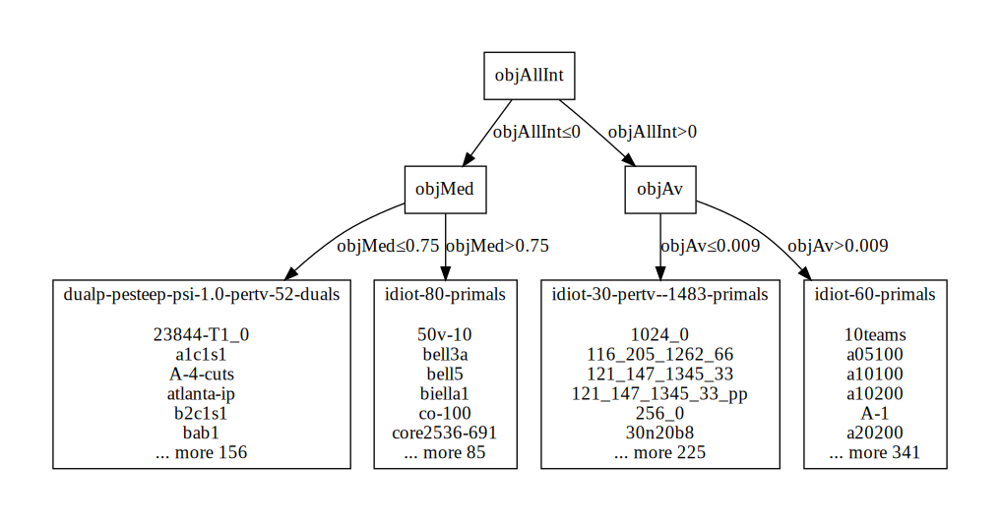

# fbps

Feature Based Parameter/Algorithm Selection Software and Data

Considering that for different problem classes different algorithms may
perform better, one problem that arises is how to automatically identify
these problem classes and suggest algorithm/parameter setting
configurations.

## Structure

### Data

The *data* folder contains in its subfolder *instances* problem datasets
for different domains. The subfolder *instance/mip*, for instance,
contains a collection of Mixed-Integer Programming instances that were
used in experiments of the COIN-OR Branch-and-Cut Solver CBC.

The data subfolder *experiments* contains experimental results of using
different algorithms and parameter settings to solve these problem
datasets. The more different algorithms and parameter settings are
included in this database the better. Please note that even
algorithms and parameter settings that perform *poorly* in average can be
useful for a relevant subset of instances.  

### Software

Python software is included for the automated generation of decision
trees. A decision tree with maximum depth 2 to select parameters for the
CBC solver can be generated with the following command:

```sh
python dtree.py ../data/instances/mip/features.csv ../data/experiments/cbc/relaxation.csv 2
```

Code is compatible with [Pypy](https://pypy.org) just in time compiler,
just replace python with pypy if you want it to run faster.

In the previous example, the following decision tree would be generated:



